# 🍕 Food Delivery Website

---

## 📖 **About the Project**

🍽 **Food Delivery Website** is a **Full-Stack Web Application** built using **Spring Boot (Backend)** and **React (Frontend)**.  
It allows users to **browse food items**, **add them to the cart**, and **place orders with secure online payments via Razorpay**.  
It also includes an **Admin Panel** to **manage food items**, **users**, and **orders** efficiently.

Built with:  
✅ **Spring Boot** for backend  
✅ **React.js** for frontend & admin panel  
✅ **MongoDB** for database  
✅ **Razorpay** for secure payments  

---

## ✨ **Features**

### 👨‍🍳 **For Customers**
✔ 🔐 **User Authentication** (Sign Up & Login)  
✔ 🍔 **Browse Food Menu** by categories  
✔ 🛒 **Add to Cart & Manage Items**  
✔ 💳 **Online Payment Integration** using **Razorpay**  
✔ 📱 **Responsive Design** with **Bootstrap**  
✔ 🔔 **Real-time Notifications** using React Toastify  

### 🛠 **For Admin**
✔ ➕ **Add, Update, Delete Food Items**  
✔ 👥 **Manage Users & Orders**  
✔ ✅ **Order Status Management** (Pending, Completed)  
✔ 📊 **Responsive Admin Dashboard**  

### 🔗 **Backend Features**
✔ 🛠 **RESTful APIs** with Spring Boot  
✔ 🔒 **JWT Authentication & Authorization**  
✔ 📦 **MongoDB Database**  
✔ ☁ **AWS S3 Integration** for image storage  
✔ 💰 **Razorpay Payment Gateway**  

---

## 🛠 **Tech Stack**

### 🎨 **Frontend**
- ⚛ **React.js**  
- 🔗 **React Router DOM**  
- 🔔 **React Toastify**  
- 🎨 **Bootstrap & Icons**  
- 🌐 **Axios**  

### ⚙ **Backend**
- ☕ **Spring Boot**  
- 🔐 **Spring Security**  
- 🗄 **MongoDB**  
- 🔑 **JWT Authentication**  
- 💳 **Razorpay Java SDK**  
- ☁ **AWS S3**  
- ✅ **Lombok**  

### 📊 **Admin Panel**
- ⚛ **React.js**  
- 🎨 **Bootstrap**  
- 🌐 **Axios**  

---

## 💳 **Payment Integration**

🔗 **Razorpay API** is integrated for secure and seamless online payments.  
✅ **How it works:**  
- 🖥 **Backend** generates an **Order ID** using **Razorpay Java SDK**.  
- 🌐 **Frontend** initializes **Razorpay Checkout** for secure payment processing.  
- ✅ Once payment is successful, the **order status is updated** in the database.  

✔ This ensures a **safe and smooth payment experience** for users.

---

## 📸 **Screenshots**

### 👤 **User Authentication (Register & Signup)**
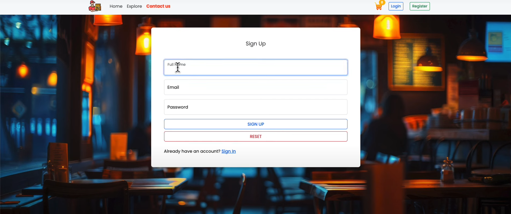
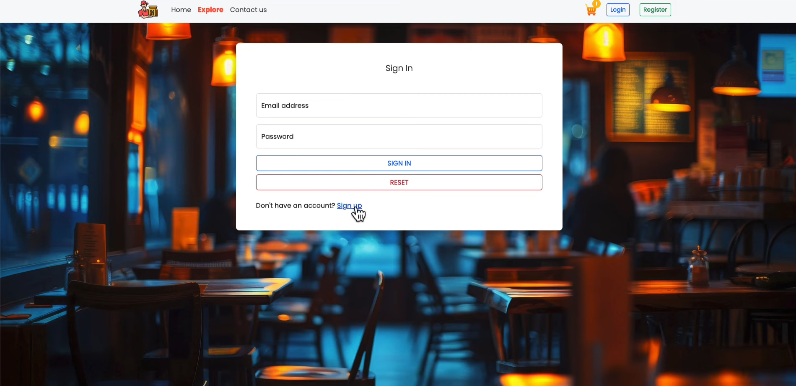  

### 🏠 **Homepage**
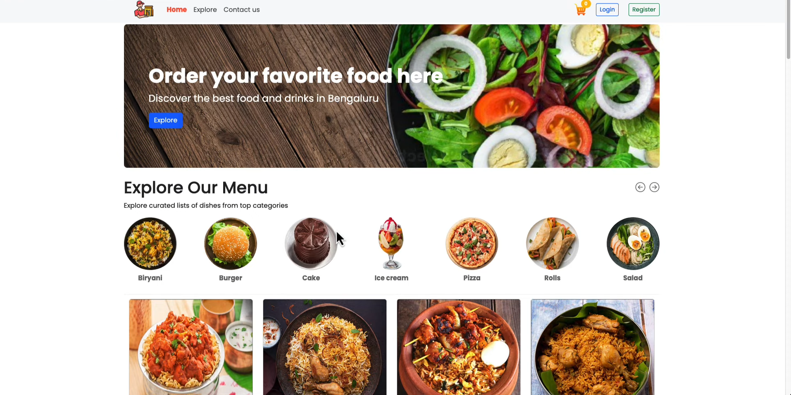

### 🍽 **Explore Tab **
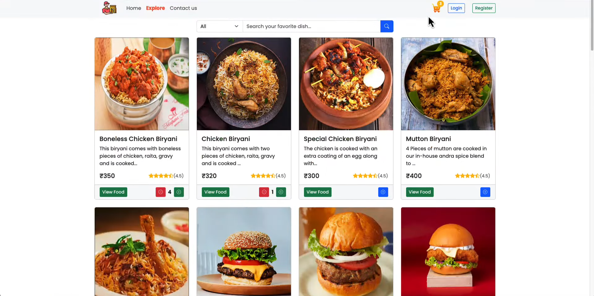  

### 🍽 ** Menu**
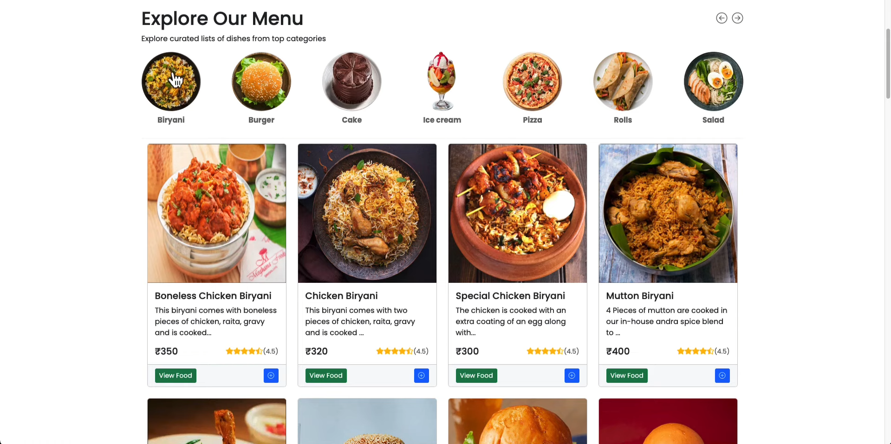

### 🥗 **Food Card**
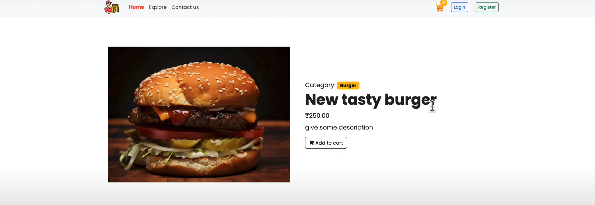  

### 🛒 **Shopping Cart**
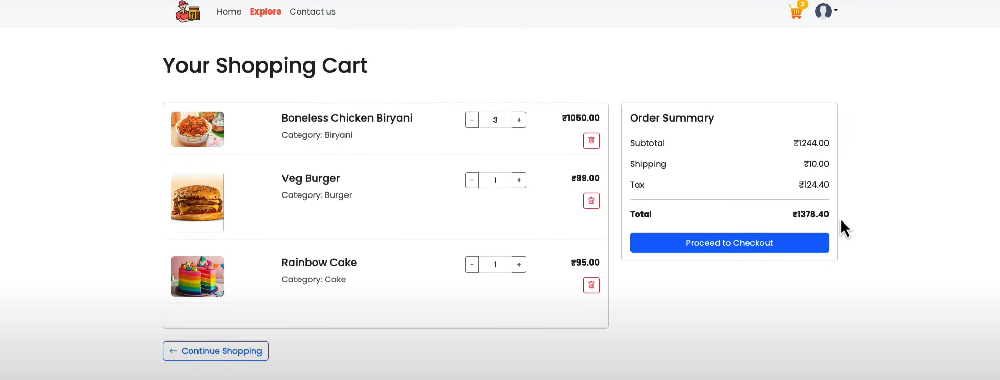

### 📦 ** Billing Address**
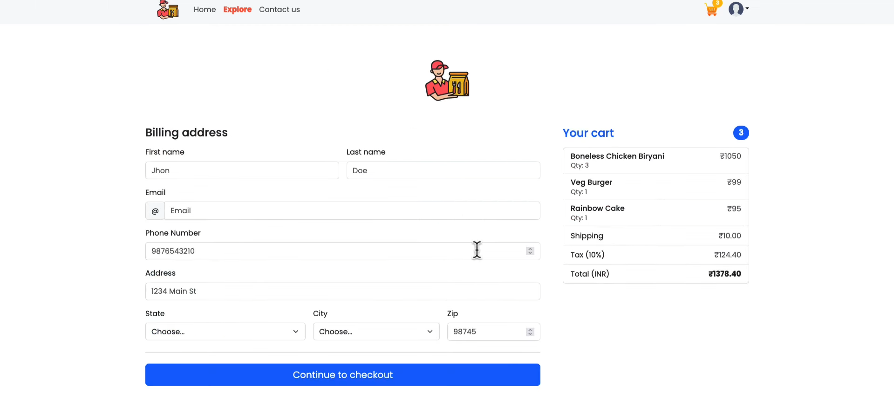

### 💳 **Payment Gateway**
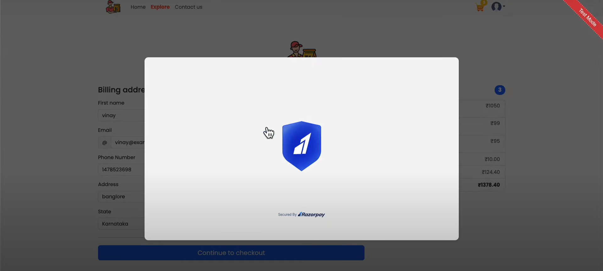

### 📦 **Orders **
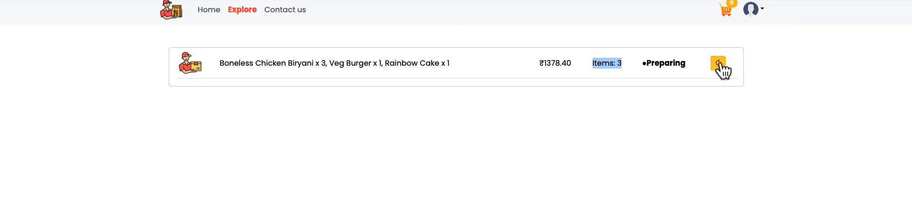  

### 🛠 **Admin Panel**
 ➕ **Add Food**
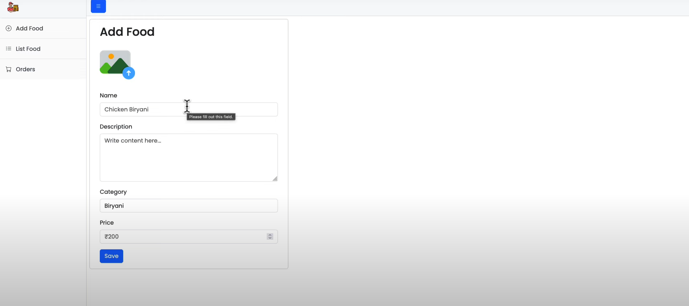
 📦 **Food Listing**
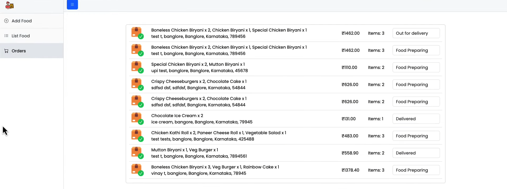
 🛒 **All Orders**
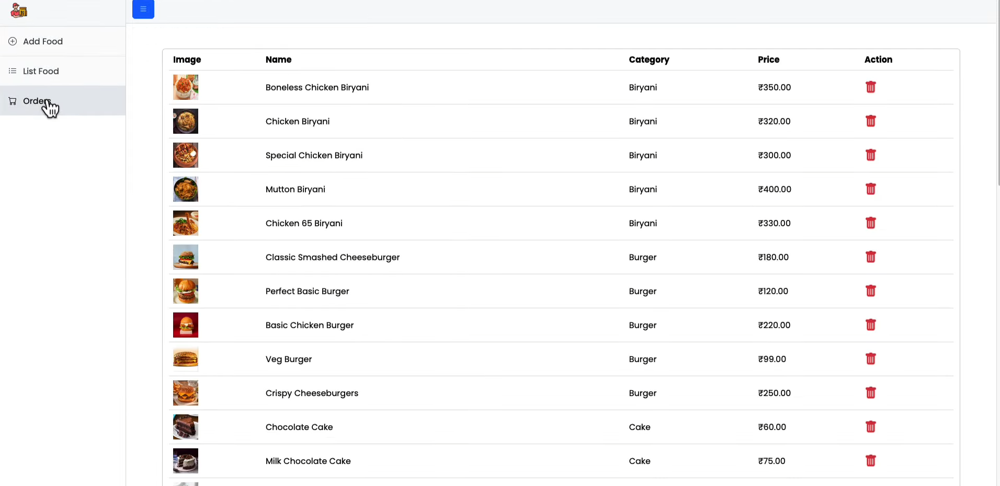  

